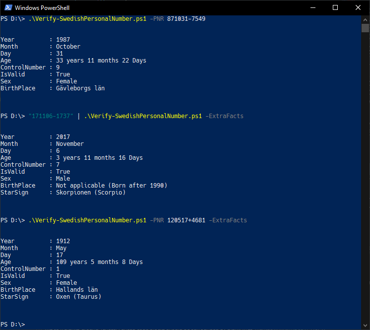

# Description #

This script will validate a Swedish personal number (Social Security Number) using the Luhn-algorithm (modulus-10). It will also validate that the string is a valid date.

> All personal identity numbers in the examples are generated ones!



## Usage examples ##

This will validate a Swedish personal number (Social Security Number) and the persons birth place and sex/gender (Since the default value for the parameter `ValidateBirthPlaceAndSex` is `$True`)

```powershell
./Verify-SwedishPersonalNumber.ps1 -PNR 871031-7549
```

\
This will too validate a Swedish personal number (Social Security Number) and the persons birth place and sex/gender

```powershell
./Verify-SwedishPersonalNumber.ps1 -PNR 871031-7549 -ValidateBirthPlaceAndSex:$true
```

\
This will validate a Swedish personal number (Social Security Number), the persons birth place and sex/gender together with the persons star sign.

```powershell
./Verify-SwedishPersonalNumber.ps1 -PNR 871031-7549 -ValidateBirthPlaceAndSex:$true -ExtraFacts:$true 
```

## Parameters ##

### **-PNR** ###

The Swedish personal number (Social Security Number) to validate. \
Possible formats are: yyMMdd-XXXX, yyMMddXXXX, yyyyMMdd-XXXX and yyyyMMddXXXX\
The dash delimiter can be any delimiter of your choice, however usage of a plus sign as delimiter indicates the person is of age 100 or more.  

### **-ValidateBirthPlaceAndSex** ###

Default value: $True \
This will validate the persons birth place and sex/gender.

### **-ExtraFacts** ###

Default value: $False \
Evaluate extra facts based on the personal number.

## Sources of facts ##

* [Wikipedia Sweden: Personnummer i Sverige](https://sv.wikipedia.org/wiki/Personnummer_i_Sverige)
* [Wikipedia Sweden: Luhn-algoritmen](https://sv.wikipedia.org/wiki/Luhn-algoritmen)
* [The Swedish Tax Agency: The structure of a personal identity number](https://skatteverket.se/servicelankar/otherlanguages/inenglish/individualsandemployees/livinginsweden/personalidentitynumberandcoordinationnumber.4.2cf1b5cd163796a5c8b4295.html)
* [Wikipedia English: Personal identity number (Sweden)](https://en.wikipedia.org/wiki/Personal_identity_number_(Sweden))
